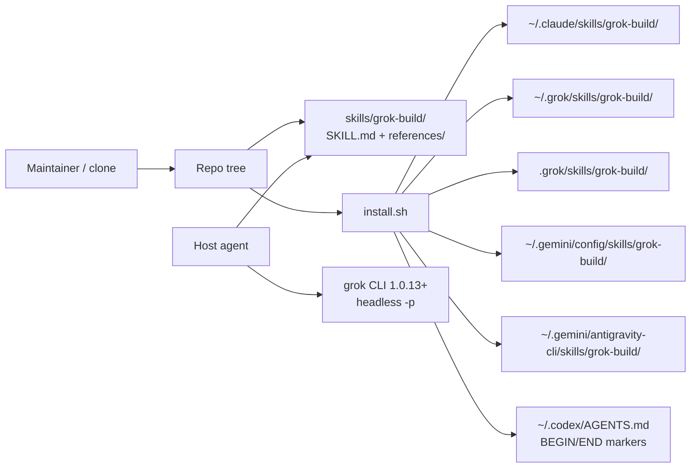

# Architecture

> Hub: [AGENTS.md](../AGENTS.md) · Decisions: [docs/decisions/](./decisions/) · Features: [docs/features/](./features/)

**Last updated:** 2026-08-30

## Overview

This repository ships an **Agent Skill** and a **POSIX installer**. Hosts read Markdown; `install.sh` copies or embeds that Markdown. There is no application server, ORM, or package manager manifest.

## Context diagram

## Components

| Component | Responsibility | Key paths |
|-----------|----------------|-----------|
| Skill entrypoint | When to use, native vs CLI, preflight, critical recipes | `skills/grok-build/SKILL.md` |
| Flag / format / session tables | Overflow detail; keep SKILL slim | `skills/grok-build/references/*.md` |
| Installer | Six destinations, including two AGY roots; local tree vs `REPO_RAW`; `--uninstall` | `install.sh` |
| Contract validator | Frontmatter, required concepts, dead-flag ban | `scripts/validate-skill.sh` |
| Installer smoke | FAKE_HOME only; idempotency + uninstall | `scripts/install-smoke.sh` |
| Live CLI sync | Optional; skip if `grok` absent | `scripts/sync-check-cli.sh` |
| Integrity | Hashes for installer + skill files | `SHA256SUMS` |
| CI | validate + checksums + smoke + optional sync | `.github/workflows/ci.yml` |

## Key patterns

- **Progressive disclosure:** entrypoint ≤220 lines; six named references; no seventh unless `flags-1.0.md` overflows.
- **Local vs remote install:** on-disk `install.sh` (or `GROK_BUILD_SKILL_ROOT`) copies the tree; `curl | bash` fetches `REPO_RAW` and must **not** treat CWD as a skill root.
- **Codex is embed-not-copy:** markers `<!-- BEGIN grok-build skill -->` / `<!-- END grok-build skill -->` in `~/.codex/AGENTS.md`.
- **AGY is dual-copy:** canonical `~/.gemini/config/skills/grok-build/` plus `~/.gemini/antigravity-cli/skills/grok-build/`; never `~/.agy/skills`.
- **Code wins vs CLI:** `sync-check-cli.sh` compares live `grok --help` / `grok models` when present. Hidden flags live in completions even when omitted from `--help`.

## Technology choices

| Layer | Choice | Why |
|-------|--------|-----|
| Language/runtime | POSIX bash + Markdown | Matches skill hosts; no Node/Python needed to install |
| Distribution | GitHub raw + clone | One-liner and checksummable tree |
| Integrity | `SHA256SUMS` of installer + skill files | Pipe-to-bash cannot verify `install.sh` itself |
| Tests | bash scripts + GitHub Actions | No unit-test framework in-tree |

## Data & boundaries

- Skill files are the product. Hosts load them; this repo does not phone home.
- Installer writes only under detected agent dirs / the two exact AGY `.gemini` roots / project `.grok/skills/` / Codex `AGENTS.md`.
- Smoke tests **must** override `HOME` to a temp dir (`install-smoke.sh`).

## Cross-cutting concerns

- AuthN for *using grok* is out of band (`grok login`). The installer does not log the user in.
- `XAI_API_KEY` is a grok CLI fallback when no session token exists; skill recipes do not rely on it.
- `.grok/` and `.orderfield/` are gitignored (local skill copy / local orchestration state).

## Feature map

| Feature | Doc | Notes |
|---------|-----|-------|
| grok-build skill | [features/grok-build-skill/README.md](./features/grok-build-skill/README.md) | Host-facing contract |
| Installer | [features/installer/README.md](./features/installer/README.md) | Six dest, including AGY |
| Validation & CI | [features/validation-ci/README.md](./features/validation-ci/README.md) | Gate before publish |

## Non-goals / deferred

- Writing `~/.codex/skills/grok-build`
- Full catalog of low-priority grok subcommands (`dashboard`, `plugin`, `trace`, `wrap`, `share`, `setup`, `leader`, `workspace`)
- Knowledge-dashboard HTML / `audit-claims.sh` (not in this tree)

## Related

- Requirements: [requirements.md](./requirements.md)
- Roadmap: [roadmap.md](./roadmap.md)
- ADRs: [decisions/](./decisions/)
