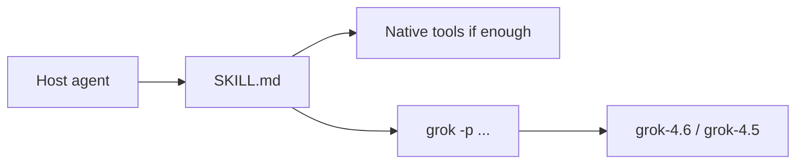

# Feature: grok-build skill

> Hub: [AGENTS.md](../../../AGENTS.md)  
> Related: [Architecture](../../architecture.md) · [Roadmap](../../roadmap.md) · [Decisions](../../decisions/)

**Status:** Real  
**Slug:** `grok-build-skill`  
**Last updated:** 2026-08-30

## Purpose

Teach host agents the **Grok Build CLI 1.0.13+** headless contract so they can delegate via `grok -p` without using dead flags or stale model names.

## Canonical authority

| Topic | Authority | This pack's role |
|-------|-----------|------------------|
| When to use / recipes | [`skills/grok-build/SKILL.md`](../../../skills/grok-build/SKILL.md) | Entry + links |
| Flags | [`references/flags-1.0.md`](../../../skills/grok-build/references/flags-1.0.md) | Link |
| Output / spend JSON | [`references/output-formats.md`](../../../skills/grok-build/references/output-formats.md) | Link |
| Sessions | [`references/sessions-and-resume.md`](../../../skills/grok-build/references/sessions-and-resume.md) | Link |
| Failures | [`references/failure-modes.md`](../../../skills/grok-build/references/failure-modes.md) | Link |
| Quality without dead flags | [`references/quality-without-best-of-n.md`](../../../skills/grok-build/references/quality-without-best-of-n.md) | Link |
| Prompt templates | [`references/prompt-templates.md`](../../../skills/grok-build/references/prompt-templates.md) | Link |

Do not re-narrate those files here.

## Users & success

- **Primary users:** Host agents invoking `/grok-build` or reading Codex `AGENTS.md`
- **Success metrics:** `./scripts/validate-skill.sh` passes; live `grok models` still lists the documented fallback
- **Out of scope:** TUI chrome, dashboard/OTEL, wrapping `grok` as a library

## Acceptance criteria

- [x] Frontmatter `version: "3.1"` and `last-updated: "2026-08-30"`
- [x] Entrypoint ≤220 lines (currently 214)
- [x] Default model string `grok-4.6`; `grok-4.5` mentioned
- [x] Headless worktree caveat: `-p` does not create a worktree from `--worktree`
- [x] Four output formats including `streaming-messages-json`

## Public surface

| Kind | Surface | Notes |
|------|---------|-------|
| Skill file | `skills/grok-build/SKILL.md` | Host entry |
| References | `skills/grok-build/references/*.md` | Six files |
| CLI (external) | `grok -p` / `--prompt-file` / `--prompt-json` | Not this repo’s binary |

## How it works

Hosts load the skill. Recipes call the user’s `grok` binary. Discovery is mandatory (`grok models`, `grok doctor`, `grok inspect`). Quality is host multi-run + tests — not `--best-of-n`.

## Design decisions

- [ADR-0001](../../decisions/0001-slim-entrypoint-and-six-references.md)

## Edge cases & risks

- Hidden flags (`--no-auto-update`, `--memory-flush`, `--load`, …) are live in completions but omitted from default `grok --help`.
- Codex embed may lack overflow tables unless a directory install also happened.

## Open questions

- None structural. Next CLI bump is a sync, not a redesign.

## Related docs

- Installer: [../installer/README.md](../installer/README.md)
- Validation: [../validation-ci/README.md](../validation-ci/README.md)
