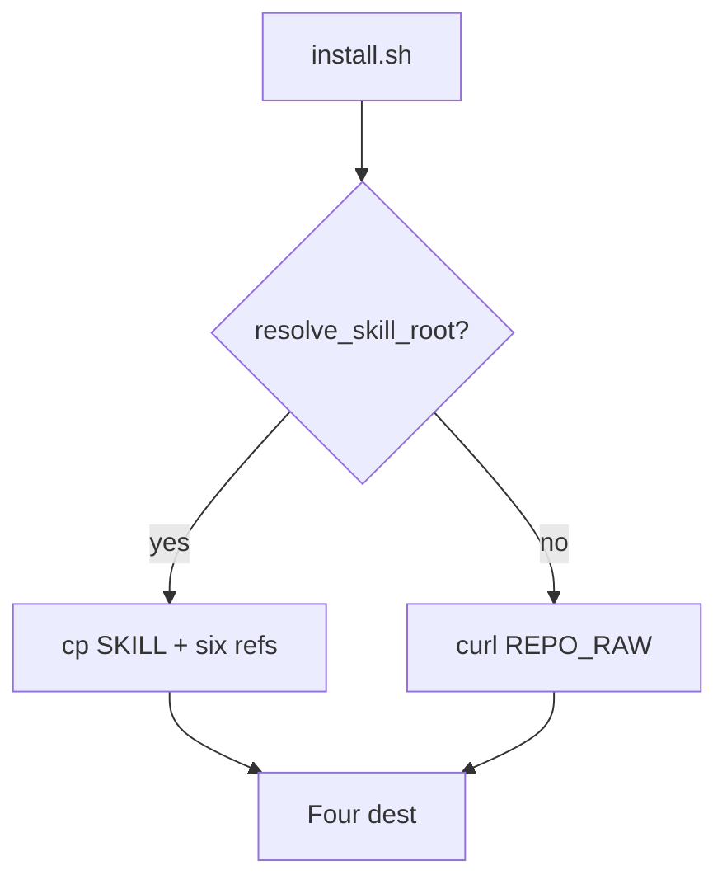

# Feature: Installer

> Hub: [AGENTS.md](../../../AGENTS.md)  
> Related: [Architecture](../../architecture.md) · [PUBLISH.md](../../../PUBLISH.md)

**Status:** Real  
**Slug:** `installer`  
**Last updated:** 2026-08-30

## Purpose

Copy or embed the skill into the hosts this repo supports, idempotently, without using CWD as a skill root when the script is piped to bash.

## Canonical authority

| Topic | Authority | This pack's role |
|-------|-----------|------------------|
| Behavior | [`install.sh`](../../../install.sh) | Entry |
| Consumer steps | [`README.md`](../../../README.md) · [`PUBLISH.md`](../../../PUBLISH.md) | Link |
| Destinations decision | [ADR-0002](../../decisions/0002-four-installer-destinations.md) | Link |

## Users & success

- **Primary users:** Humans running `./install.sh` or the curl one-liner
- **Success metrics:** `./scripts/install-smoke.sh` green; four dest on a machine that has Claude/Grok/Codex homes
- **Out of scope:** Installing the `grok` binary; `grok login`

## Acceptance criteria

- [x] Four destinations only (Claude dir, Grok user dir, project-local, Codex `AGENTS.md`)
- [x] Does **not** write `~/.codex/skills/grok-build`
- [x] `--uninstall` removes dests; second uninstall reports nothing to remove
- [x] Hard-fail if any of the six references is missing
- [x] `GROK_BUILD_SKILL_ROOT` / on-disk script for local tree; else `REPO_RAW`

## Public surface

| Kind | Surface | Notes |
|------|---------|-------|
| CLI | `./install.sh` | Optional `--uninstall` |
| Env | `GROK_BUILD_SKILL_ROOT`, `GROK_BUILD_SKILL_RAW` | Root override / remote base |
| Files | `SHA256SUMS` | Does not cover README/CHANGELOG/scripts |

## How it works

Detection: `command -v claude|grok|codex` **or** `$HOME/.claude|.grok|.codex`. Project-local: CWD `.git` **or** `.grok/config.toml`. Codex: `strip_block` then append BEGIN/END around `fetch_skill_stdout`.

## Edge cases & risks

- Piped `bash` with `$0=bash` must not pick a random CWD `skills/` tree.
- Running install **inside this git repo** always writes project-local `.grok/skills/` (gitignored).

## Related docs

- Skill: [../grok-build-skill/README.md](../grok-build-skill/README.md)
- Smoke: [../validation-ci/README.md](../validation-ci/README.md)
